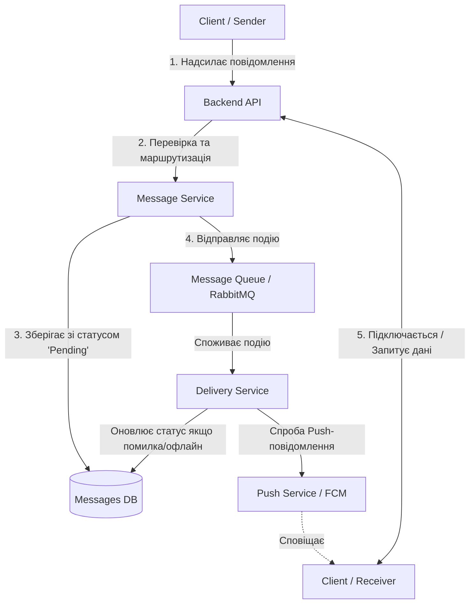
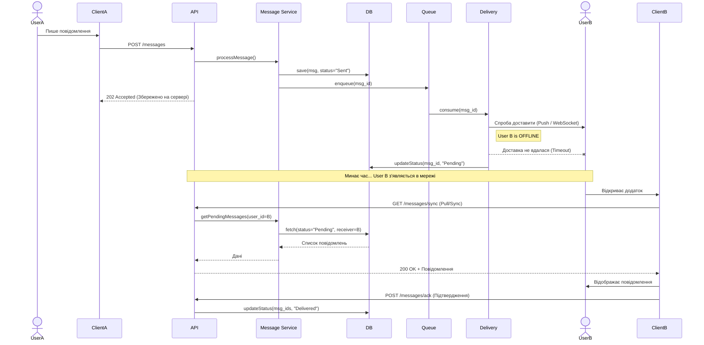
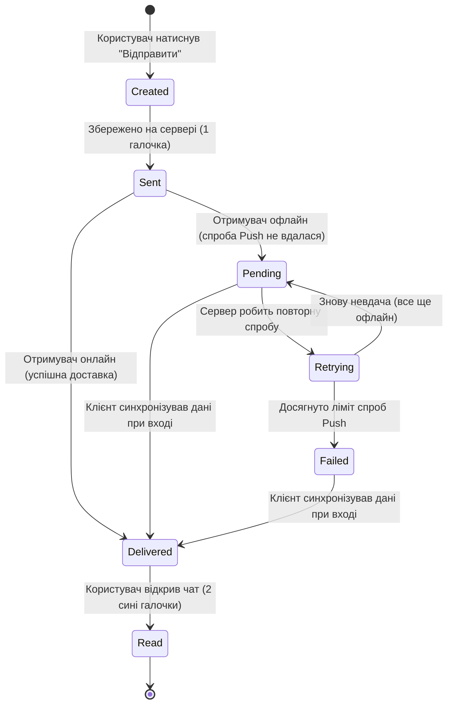

## Part 1 — Component Diagram (30%)

**Task:** Create a Component Diagram that shows system components, their responsibilities, and interactions between them.



---

## Part 2 — Sequence Diagram (25%)

**Scenario:** User A sends a message to user B who is offline.
**Task:** Describe the interaction sequence in time.



---

## Part 3 — State Diagram (20%)

**Object:** `Message`
**Task:** Describe the message lifecycle.



---

## Part 4 — ADR (Architecture Decision Record) (25%)

**Task:** Document one architecture decision.

```markdown
# ADR-001: Use Hybrid Delivery (Push + Pull Sync) for Offline Users

## Status
Accepted

## Context
Our system must support users who are offline for extended periods. The challenge is ensuring messages are not lost while balancing server load. Using only a Message Queue with infinite retries is resource-intensive, and using only Client Polling drains client battery.

## Decision
We will use a hybrid approach:
1. Store all messages persistently in a Database immediately upon receipt.
2. Use a Message Queue and Delivery Service to attempt initial Push notifications.
3. If delivery fails (user is offline), mark the message as `Pending` in the DB and remove it from the active retry queue.
4. Require the client application to perform a "Sync" (Pull request) against the Backend API whenever it comes back online to retrieve all `Pending` messages.

## Alternatives
- **Infinite Queue Retry (Rejected):** Storing messages in a queue like RabbitMQ/Kafka for weeks until a user connects is inefficient and risks data loss if the queue is purged.
- **Strict Client Polling (Rejected):** Forcing clients to ping the server every 5 seconds drains battery and creates unnecessary network traffic.

## Consequences
+ **Positive:** 100% reliable delivery; no messages are lost even during long offline periods. Reduced load on message brokers.
- **Negative:** Increased complexity in the client-side application (must implement synchronization logic on startup). Increased load on the database during mass reconnect events.
```